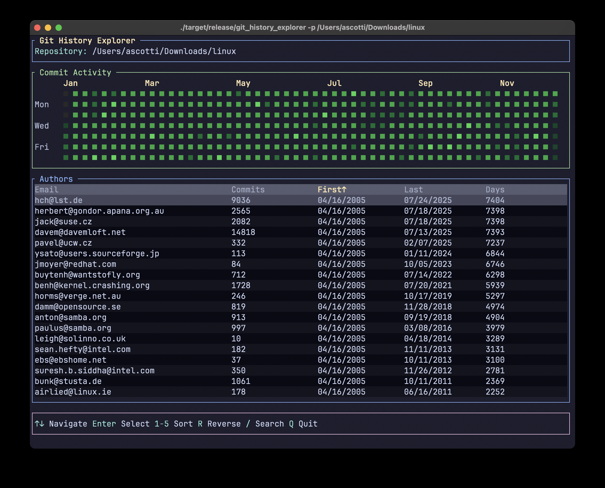

# Git History Explorer

Git History Explorer is a terminal-based interactive application that analyzes Git repository commit metadata and displays visualizations of author activity. It provides both an overview of all contributors and detailed individual author analysis through an intuitive text-based user interface.



## Features

### 📊 **Repository Analysis**
- Analyze the complete commit history of any Git repository
- Display comprehensive commit statistics for each author:
  - Total number of commits
  - First commit date
  - Last commit date
  - Days between first and last commit
- Handle different time zones and daylight saving time changes automatically
- Optimized for performance with large repositories using Polars data processing

### 🎨 **Interactive Heatmap Visualization**
- **Overview Mode**: Shows commit activity patterns across all authors
- **Author-Specific Mode**: Display individual author commit patterns
- **Color-Coded Intensity**: Visual representation of commit frequency (4 intensity levels)
- **Calendar Year View**: Commits mapped to current year calendar for easy pattern recognition
- **Real Data**: Uses actual commit timestamps and dates from the repository

### 🎮 **Interactive Controls**
- **Navigation**: Use arrow keys (↑↓) to browse through authors
- **Author Selection**: Press Enter to select/deselect authors for detailed heatmap view
- **Sorting**: Sort by any column using number keys (1-5):
  - 1: Email
  - 2: Commits
  - 3: First Commit
  - 4: Last Commit
  - 5: Days Between
- **Reverse Sort**: Toggle sort direction with R key
- **Search**: Filter authors by email using / key
- **Exit**: Quit with Q or Esc

### 🔍 **Smart Filtering**
- Real-time author search by email address
- Instant filtering as you type
- Maintains sorting preferences while filtering

## Usage

### Basic Usage
Run the application in your terminal:

```bash
git_history_explorer
```

This will analyze the Git repository in the current directory.

### Specify Repository Path
Analyze a specific repository:

```bash
git_history_explorer --path /path/to/your/repo
```

### Short Option
```bash
git_history_explorer -p /path/to/your/repo
```

## Interactive Controls Reference

| Key | Action |
|-----|--------|
| `↑` `↓` | Navigate through author list |
| `Enter` | Select/deselect author for heatmap view |
| `1` | Sort by email |
| `2` | Sort by commit count |
| `3` | Sort by first commit date |
| `4` | Sort by last commit date |
| `5` | Sort by days between commits |
| `R` | Reverse sort direction |
| `/` | Enter search mode |
| `Q` `Esc` | Quit application |

## User Interface

The application interface is divided into four main sections:

1. **Header**: Shows repository path and total authors (with selected author info)
2. **Heatmap**: Visual commit activity chart (25% of screen height)
3. **Author Table**: Sortable and filterable list of authors with statistics
4. **Footer**: Interactive controls help and search input

## Installation

### Prerequisites
- Rust and Cargo: https://www.rust-lang.org/tools/install
- Git repository to analyze

### Install from Source

1. Clone the repository:
```bash
git clone https://github.com/amscotti/git_history_explorer.git
cd git_history_explorer
```

2. Build and install:
```bash
cargo install --path .
```

3. Run the application:
```bash
git_history_explorer
```

### Development Installation

For development or testing:

1. Clone the repository
2. Install dependencies:
```bash
cargo build
```

3. Run from source:
```bash
cargo run
```

## Examples

### Analyze Current Repository
```bash
git_history_explorer
```

### Analyze Specific Repository
```bash
git_history_explorer --path ~/projects/my-awesome-project
```

### Use with Different Repositories
```bash
# Linux/macOS
git_history_explorer -p ~/.dotfiles

# Windows
git_history_explorer -p C:\Users\username\project
```

## How It Works

1. **Data Collection**: Walks through Git commit history using `git2` crate
2. **Data Processing**: Uses Polars for efficient data aggregation and analysis
3. **Timeline Generation**: Creates individual author timelines with actual commit dates
4. **Interactive UI**: Renders using `ratatui` for responsive terminal interface
5. **Real-time Updates**: Handles user interactions with immediate visual feedback

## Performance

- **Optimized Processing**: Uses Polars DataFrame operations for fast data analysis
- **Memory Efficient**: Streams commit data to minimize memory usage
- **Large Repository Support**: Tested with repositories containing millions of commits
- **Fast Rendering**: Efficient terminal UI updates for smooth interaction

## Requirements

- Rust 1.70+ (edition 2024)
- Git repository with commit history
- Terminal with UTF-8 support recommended

## License

See LICENSE file for details.

## Usage

Run the command in your terminal:

```bash
git_history_explorer [OPTIONS]
```

Options:

- `-p, --path <PATH>`: Specify the path to the Git repository (default is the current directory)

## Installation

1. Install Rust and Rustup: https://www.rust-lang.org/tools/install
2. Clone this repository: `git clone https://github.com/amscotti/git_history_explorer.git`
3. Change to the project directory: `cd git_history_explorer`
4. Build and install the tool: `cargo install --path .`

You can now run `git_history_explorer` from your command line.
